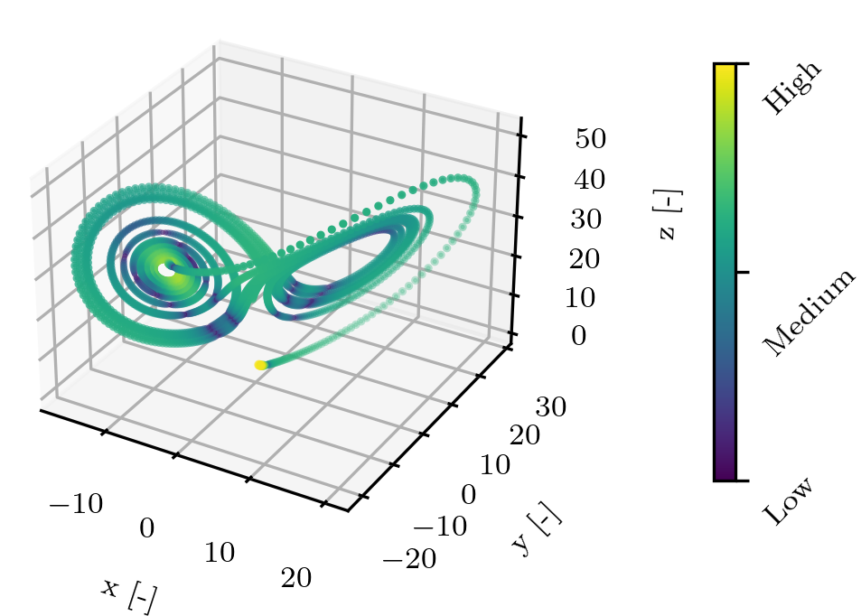
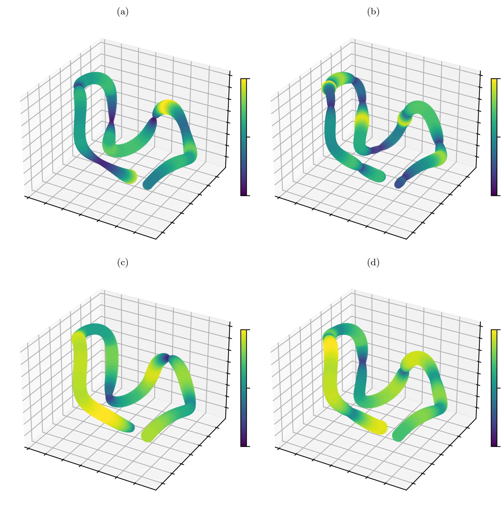

# Multivariate Time Series Sub-Sequence Clustering Metric

 [](https://www.python.org/downloads/release/python-390/)

This repository provides a Python package for computing a multivariate time series subsequence clustering metric[^koehn].
The purpose is to have a meaningful metric for comparing time-series clustering algorithms.

## Motivation

To our knowledge no existing clustering metric exists, that takes the time space variations like curvature, acceleration or torsion in a multidimensional space into consideration. We believe using these curve parameters, is an intuitive method to measure similarities between mechatronic system state changes or subsequences in multivariate time-series data (MTSD) in general.

## Details

Our MT3SCM score consists of three main components

$$
mt3scm = (cc_w + s_L + s_P) / 3
$$

The weighted curvature consistency ( $cc_w$ ), the silhouette location based ( $s_L$ ) and the silhouette curve-parameter based ( $s_P$ ). When making the attempt of clustering TSD, it is subjective and domain specific. Nevertheless, we try to take the intuitive approach of treating MTSD as space curves and use the parameterization as a similarity measure. This is done in two different ways. First we create new features by computing the curve parameters sample by sample (e.g.: curvature, torsion, acceleration) and determine their standard deviation for each cluster. Our hypothesis is, that with a low standard deviation of the curve parameters inside a cluster, the actions of a mechatronic system in this cluster are similar. We call this the curvature consistency ( $cc$ )

The second procedure is to apply these newly computed features, which are computed to scalar values per subsequence, onto a well established internal clustering metric, the silhouette score[^rous1]

The computation of the $cc$ comprises the calculation of the curvature $\kappa$ and the torsion $\tau$ at every time step $t$ with $\boldsymbol{x}_{t}$ .

Afterwards the $cc$ is calculated per cluster $i \in \mathcal{I}$ , by taking the empirical standard deviation for each curve parameter (exemplarily for $\kappa$ in with the set of subsequence indexes $\mathcal{J}_i$ within our cluster $i$ ).
The arithmetic mean of the standard deviations for the curvature $\kappa$, torsion $\tau$ and the acceleration $a$ results in the final $cc$ per cluster.

The main idea of this approach is to combine three main parts inside one metric.
First incentive is to reward a **low standard deviation of the curve parameters** in between a cluster (accomplished by $cc$ ).
Second, to benchmark the clusters **spatial separation based on the new feature space** (curve parameters, accomplished by $s_P$ ).
And third, to benchmark the clusters **spatial separation based on the median of the subsequence in the original feature space** (accomplished by $s_L$ ).

For further details on the computation see the pubplication [^koehn]

# Usage

There are two ways to compute the metric score
```python
import numpy as np
from mt3scm import mt3scm_score
# Number of datapoints (time-steps)
n_p = 1000
# Number of dimensions or features
dim = 5
X = np.random.rand(n_p, dim)
# Number of clusters
n_c = 5
y = np.random.randint(n_c, size=n_p)

# Compute mt3scm
score = mt3scm_score(X, y)
print(score)
```

When using the class you can investigate internal values as well.

```python
from mt3scm import MT3SCM

metric = MT3SCM()
kappa, tau, speed, acceleration = metric.compute_curvature(X)
score = metric.mt3scm_score(X, y)
print(score)
print(metric.df_centers)
print(metric.df_curve)

```

## Creating plots

```bash
$ python -m main --plot
```

<figure>
    <p style="text-align:center">
        
        <figcaption>Lorenz-attractor dataset. Computed with ̇$ X = s(Y − X)$ ;  ̇$Y = rX − Y − XZ$ ;  ̇$Z = XY − bZ$ and parameters used s = 10, r = 28 and b = 2.667. Color and marker size indicate amount of curvature on a logarithmic scale for better visibility.</figcaption>
    </p>
</figure>

<figure>
    <p style="text-align:center">
        
        <figcaption>Qualitative visualization of the (a) curvature $\kappa$ , (b) torsion $\tau$ , (c) speed $v$ and (d) acceleration $a$ computed on part of the thomas-attractor dataset. Color and marker size indicate amount of curve parameter on a logarithmic scale for better visibility (dark and thin means low value, bright and thick means high value).</figcaption>
    </p>
</figure>

## Comparison of unsupervised clustering metrics with lorenz attractor data
This example shows the effect of different metrics on the lorenz attractor dataset when using different types of label arrays. For the different unsupervised clustering labels we use the AgglomerativeClustering algorithm by varying the connectivity and the linkage as well as the number of clusters (along the lines of the [scikit-learn example](https://scikit-learn.org/stable/auto_examples/cluster/plot_agglomerative_clustering.html#sphx-glr-auto-examples-cluster-plot-agglomerative-clustering-py))


## References
[^koehn]: Köhne, J. et al. Autoencoder based iterative modeling and multivariate time-series subsequence clustering algorithm

[^rous1]: "Rousseeuw, P. J. Silhouettes: A graphical aid to the interpretation and validation of cluster analysis. Journal of Computational and Applied Mathematics 20. PII: 0377042787901257, 53–65. ISSN: 03770427 (1987)"
